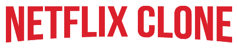
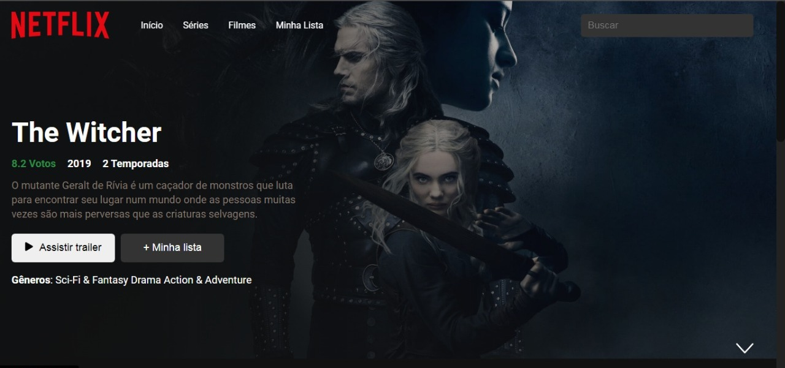
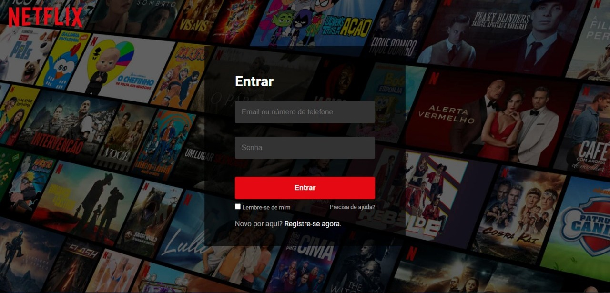
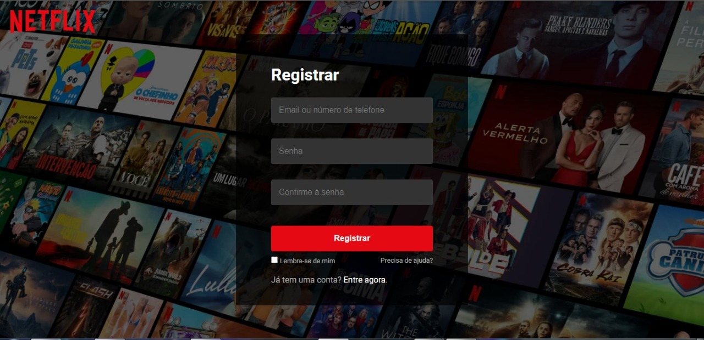
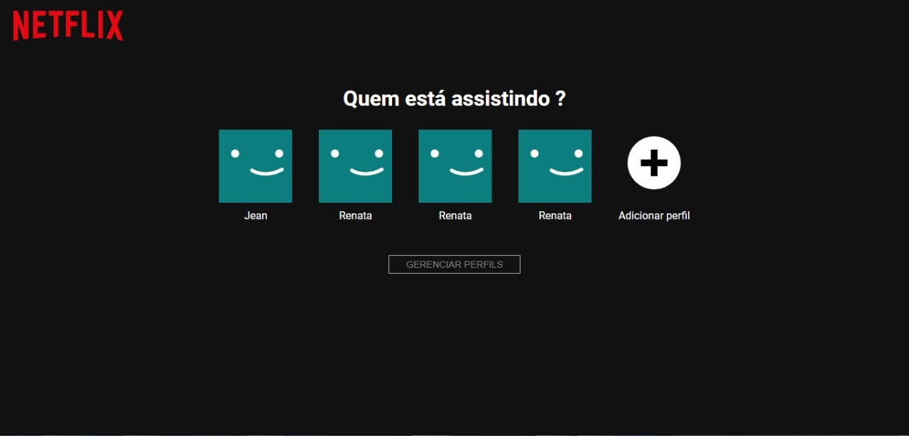

<p align="center">
  
<p>

<p align="center">
  

  

  
  <a href="https://github.com/JeanVictor44/Netflix-clone/commits/main">
    
  </a>

  
</p>


## :computer: Sobre o projeto
:film_strip: Netflix clone é um projeto de clonagem da aplicação web Netflix para fins de estudo do framework React JS 



> Página principal

## :art: Layout
<p align="center" style="display: flex; align-items: flex-start; justify-content: center;">
    
    
    
</p>

## :hammer_and_wrench: Tecnologias

As seguintes ferramentas foram usadas na construção do projeto:

- [React ](https://pt-br.reactjs.org/)
- [TypeScript](https://www.typescriptlang.org/)
- [React-Router-Dom v6](https://reactrouter.com/docs/en/v6)
- [Styled-components](https://styled-components.com/)
- [Axios](https://axios-http.com/docs/intro)
- [Npm](https://www.npmjs.com/)


### Ajustes e melhorias

O projeto ainda está em desenvolvimento e as próximas atualizações serão voltadas nas seguintes tarefas:

- [x] Criar página de login 
- [x] Criar página de registro 
- [x] Desenvolver página de navegação para acessar os filmes 
- [x] Construir pagina de perfis 
- [ ] Mostrar informações dos filmes ao passar o mouse em cima dos posters 
- [ ] Programar a funcionalidade de favoritagem 
- [ ] Página dos filmes favoritos
- [ ] Função de adicionar perfil 
- [ ] Função de editar perfil 
- [ ] Funcionalidade de armazenar o registro, perfils e filmes favoritos relacionado a cada perfil no localStorage

## :rocket: Como executar o projeto

Este projeto consome duas APIS externas: [TMDB API](https://www.themoviedb.org/documentation/api) e [YouTube Data API v3](https://console.cloud.google.com/marketplace/product/google/youtube.googleapis.com?q=search&referrer=search&hl=pt-br) portanto acesse os links para criar sua chave da API

:bulb: Não se esqueça de configurar as variáveis de ambiente levando em conta o arquivo de exemplo [.env.example](.env.example)

## Pré-requisitos

Antes de começar, você vai precisar ter instalado em sua máquina as seguintes ferramentas:
[Git](https://git-scm.com), [Node.js](https://nodejs.org/). Além disto é bom ter um editor para trabalhar com o código como [VSCode](https://code.visualstudio.com/)

### :coffee: Rodando a aplicação 

```bash
# Clone este repositório
$ git clone https://github.com/JeanVictor44/Netflix-clone

# Acesse a pasta do projeto no seu terminal/cmd
$ cd Netflix-clone

# Instale as dependências
$ npm install

# Execute a aplicação em modo de desenvolvimento
$ npm run start
      ou
$ yarn dev

# A aplicação será aberta na porta:3000 - acesse http://localhost:3000
```


## :pencil: Licença

Esse projeto está sob licença. Veja o arquivo [LICENÇA](LICENSE) para mais detalhes.
